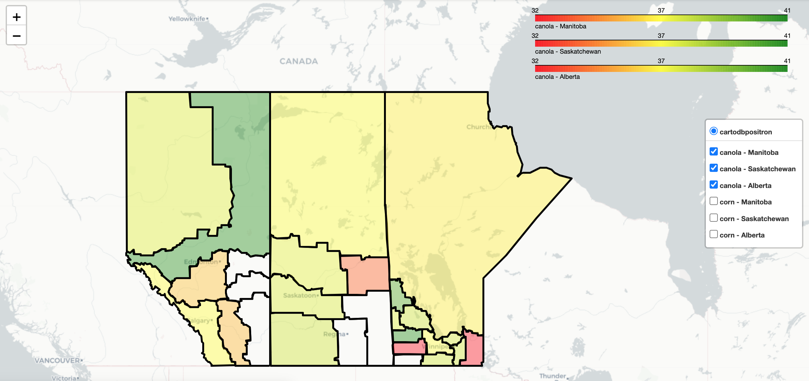

###  Canada Crop Yield Prediction based on GIS data

The project involved developing a model to predict crop yields using Canadian crop yield and geospatial weather data. The goal was to estimate the relationship between weather data and crop yields based on geographical location using various machine-learning algorithms. Google BigQuery public data was used in this project to achieve this. The XGBoost model was one of the machine learning algorithms that was applied. The model achieved a remarkable 95% accuracy rate in its predictions.

**Provinces** - 

1. Newfoundland and Labrador / Terre-Neuve-et-Labrador
2. Prince Edward Island / Île-du-Prince-Édouard
3. Nova Scotia / Nouvelle-Écosse
4. New Brunswick / Nouveau-Brunswick
5. Quebec / Québec
6. Ontario
7. Manitoba
8. British Columbia / Colombie-Britannique
9. Yukon
10. Northwest Territories / Territoires du Nord-Ouest
11. Nunavut
12. Saskatchewan
13. Alberta

**Crops** - 

1. barley
2. canary_seed
3. canola
4. corn
5. durum_wheat
6. fall_rye
7. flaxseed
8. lentils
9. mustard
10. oats
11. peas
12. soybeans
13. spring_wheat
14. winter_wheat

